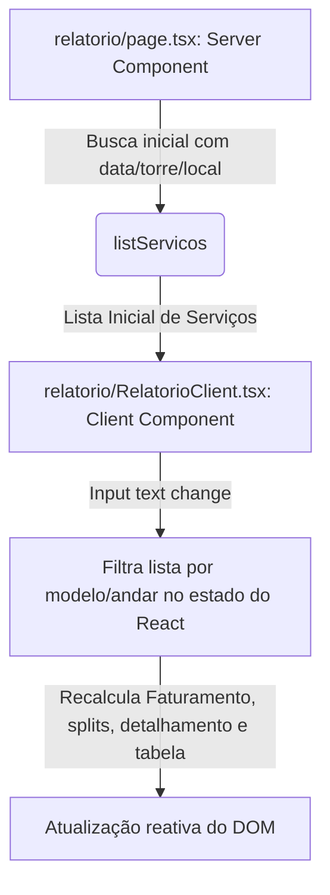

# Design Spec — Busca de Veículos na Tela de Relatórios

Especificação técnica para a barra de pesquisa em tempo real na tela de relatórios do PWA do Jonas.

## Entendimento do Problema

O Jonas precisa consultar com rapidez a quantidade de lavagens e o faturamento acumulado de um veículo específico (identificado pela combinação de Modelo e Andar, como `"BYD 2201"`) no fechamento de cada período/mês.

- A busca deve ser instantânea, filtrando tanto a tabela de registros quanto recalculando em tempo real todos os cards de faturamento, ticket médio, divisão de receita e detalhamento por funcionários.
- A pesquisa deve respeitar o escopo de tempo e localidade (mês, dia, período, torre e local) já definidos nos filtros superiores.

## Decisões de Design (Decision Log)

| Decisão | Alternativas | Raciocínio |
| --- | --- | --- |
| **Componentização Cliente/Servidor** | Manter em Server Component com recarga de URL vs. Extrair para Client Component | Optou-se por extrair para Client Component para garantir a busca dinâmica instantânea ao digitar, eliminando o lag e recargas de página na rede. Isso segue o padrão de arquitetura já consolidado na tela de Atividades. |
| **Case Sensitivity** | Conversão em tempo de busca vs. Comparação direta | Como todos os inputs de modelo e placa são normalizados e convertidos para letras maiúsculas ao salvar, faremos uma comparação direta usando `.toUpperCase()` para garantir robustez, mas focando em simplicidade. |
| **Cálculo de Totais** | Recalcular totais no cliente vs. Re-requisitar do backend | Toda a lógica matemática de splits de receita (`getParteCEO`, `getParteFuncionario`) e rankings de funcionários já está isolada em funções utilitárias puras no cliente. Recalcular no frontend é extremamente rápido e eficiente (< 1ms). |

## Arquitetura e Fluxo de Dados



## Especificação Técnica

### 1. Novo Componente Cliente: `RelatorioClient.tsx`
Criaremos o arquivo `app/(app)/relatorio/RelatorioClient.tsx` que conterá toda a interface reativa da tela de relatórios.
- **Props**: Recebe a lista inicial de serviços filtrada por período/torre/local.
- **Estados**:
  - `searchQuery` (string): Consulta digitada pelo usuário.
- **Cálculo reativo (Memoized)**:
  - `listaFiltrada`: `lista.filter(s => s.placa.includes(searchQuery.toUpperCase()))`
  - `resumo`: Executa `summarizeServicos(listaFiltrada)`.
  - `allFuncionariosReceita`: Mapeia ganhos do filtered `funcionariosRanking`.

### 2. Campo de Busca na UI
Adicionaremos um campo de input com estilo moderno (borda suave, ícone de lupa) acima da seção de faturamento:
```tsx
<div className="relative">
  <input
    type="text"
    placeholder="Buscar por modelo ou andar (Ex: BYD ou 2201)..."
    value={searchQuery}
    onChange={(e) => setSearchQuery(e.target.value)}
    className="w-full pl-10 pr-4 py-3 bg-white border border-slate-100 rounded-2xl text-sm font-semibold outline-none focus:ring-2 focus:ring-primary transition-all text-dark-navy"
  />
  <Search className="absolute left-3 top-1/2 -translate-y-1/2 text-slate-400 w-4 h-4" />
</div>
```
